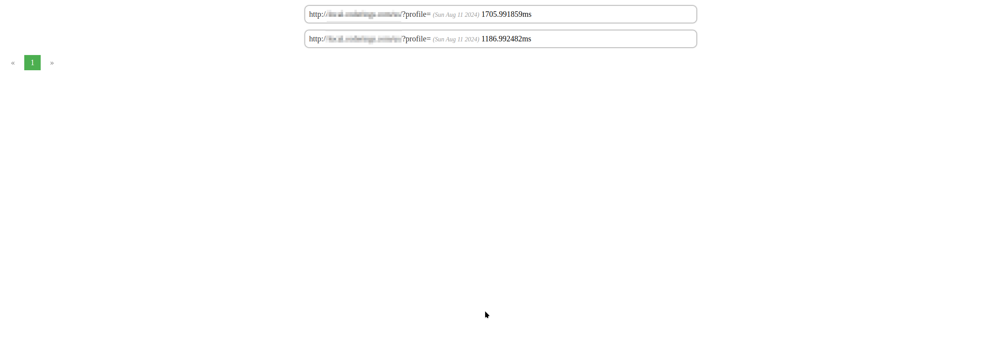

## Simple Profile Storage Server

This server is designed to act as storage for profiles generated using
the [Excimer PHP Extension](https://www.mediawiki.org/wiki/Excimer).

The project utilizes NodeJS and NestJS, and it requires MariaDB for data storage.

### Deployment Options

You can deploy the server using one of the following methods:

- [Helm chart](https://artifacthub.io/packages/helm/excimer-ui-server/excimer-ui-server)
- [Docker image](https://hub.docker.com/r/warxcell/excimer-ui-server)
- Local installation (refer to `README.nestjs.md` for more information)

### Sending Data to the Server

To send data to this server, you can:

1. Use the [PSR Request Handler](https://github.com/Warxcell/excimer-handler/) in any existing PSR-compliant server.
2. Manually send data to `http://$host/profile` by directly
   using [this PSR Client compatible class](https://github.com/Warxcell/excimer-handler/blob/main/src/SpeedscopeDataSender.php)
   or any other tool.

